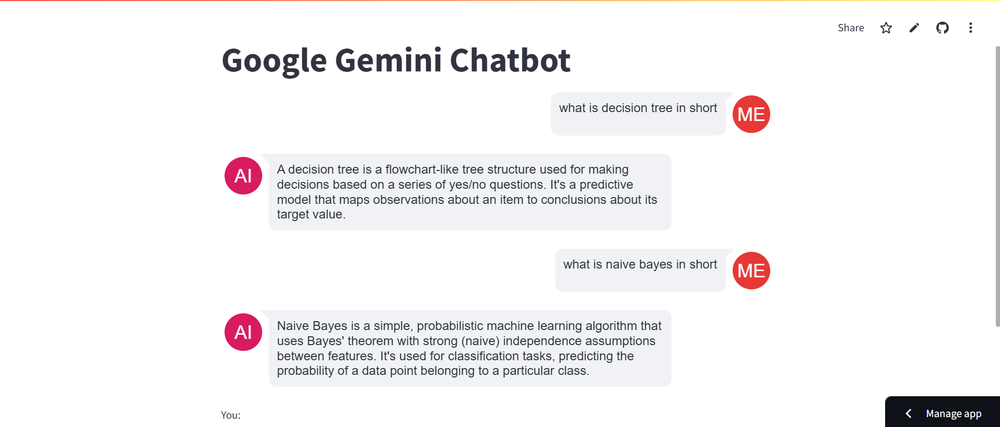

# Chatbot using GeminiAI
#
## Description

This project is a chatbot application built using GeminiAI and Streamlit. It allows users to interact with a chatbot through a web interface.

## Installation
1. **Clone the Repository**
To get started with this project, follow these steps:
    ```bash
        git clone https://github.com/pankaj7322/chatbot_using_Genai.git
2. **Navigate into the project Directory**
    cd chatbot_using_Genai
    
3. **Install the required dependencies:**
    ```bash
        pip install -r requirements.txt
4. **Run the application**
    ```bash
        treamlit run .\Gemini_Chat_Bot.py
## Usage

    Once you have the application running, you can interact wiht the chatbot through the Streamlit Interface. Enter you queries in the input box and receive responses from the chatbot.
    
    1. Open you web browser and go to the localhost
    2. Type you message into the input field and press enter.
    3. The chatbot will respond to your message in the output area.
    
## Deployment
DEPLOYED APPLICATION LINK : [https://geminichatbot-ui.streamlit.app/](https://geminichatbot-ui.streamlit.app/)

## Contact

For questions or support, please contact [pankajkumar732298@gmail.com](mailto:pankajkumar732298@gmail.com).

